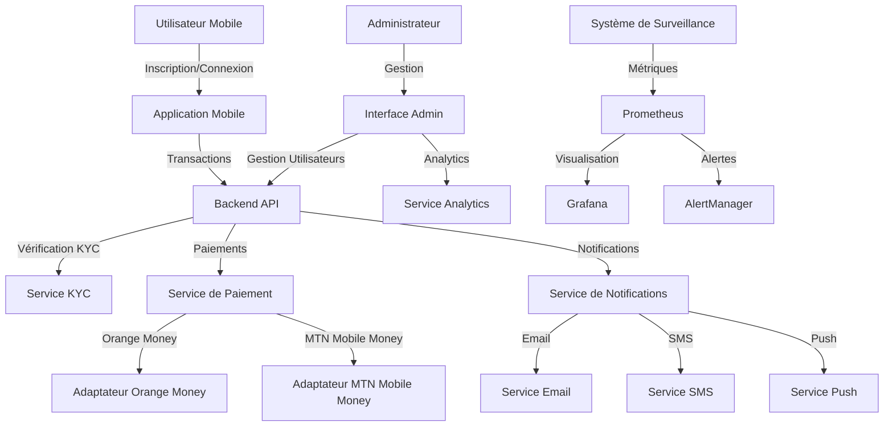

# 🌍 CROSSPAY AFRICA


<div align="center">
  
  
  **La plateforme de paiement transfrontalière révolutionnaire pour l'Afrique**
  
  *Connecter l'Afrique à travers des paiements sans frontières avec une expérience utilisateur futuriste*
</div>

---

## 🚀 Vision

**CrossPay Africa** transforme les paiements transfrontaliers en Afrique en offrant une solution unifiée, sécurisée et accessible. Notre plateforme élimine les barrières financières entre les pays africains, permettant aux utilisateurs d'envoyer et de recevoir de l'argent instantanément, quel que soit leur emplacement ou leur devise.

### 🎯 Objectifs Clés

- **Simplicité** : Interface intuitive et processus simplifié pour tous les utilisateurs
- **Rapidité** : Transactions instantanées avec confirmation en temps réel
- **Sécurité** : Chiffrement de bout en bout et conformité réglementaire stricte
- **Accessibilité** : Support de multiples devises et méthodes de paiement populaires en Afrique
- **Transparence** : Frais clairs et taux de change compétitifs

---

## 🔍 Aperçu du Système



---

## 💡 Fonctionnalités Principales

### 📱 Application Mobile
- **Transferts d'argent instantanés** entre pays africains
- **Multi-devises** avec conversion automatique aux meilleurs taux
- **Vérification KYC** sécurisée et simplifiée
- **Notifications en temps réel** (push, SMS, email)
- **Historique des transactions** détaillé et transparent
- **Paiement via Orange Money et MTN Mobile Money**

### 🖥️ Interface Administrateur
- **Tableau de bord analytique** avec visualisations avancées et design futuriste
- **Interface utilisateur moderne** avec expérience utilisateur optimisée
- **Gestion des utilisateurs** et vérification KYC simplifiée
- **Suivi des transactions** en temps réel avec notifications
- **Rapports financiers** détaillés et exportables
- **Performance du système** en temps réel avec métriques clés
- **Design responsive** adapté à tous les appareils

### 🔒 Sécurité et Conformité
- **Authentification à deux facteurs**
- **Chiffrement de bout en bout**
- **Conformité réglementaire** avec les normes africaines
- **Système anti-fraude** avancé

---

## 🔄 Flux Utilisateur

1. **Inscription et KYC**
   - L'utilisateur télécharge l'application
   - Création de compte avec email/téléphone
   - Vérification d'identité via le processus KYC
   - Approbation par l'équipe administrative

2. **Transfert d'Argent**
   - Sélection du destinataire et du montant
   - Choix de la méthode de paiement (Orange Money/MTN Mobile Money)
   - Confirmation et authentification
   - Traitement instantané de la transaction
   - Notification au destinataire

3. **Réception de Fonds**
   - Notification de réception
   - Fonds disponibles immédiatement
   - Option de retrait ou de conservation dans le portefeuille

---

## 🛠️ Architecture Technique

### 🧩 Structure du Projet
```
crosspay-africa/
├── apps/                          # Applications frontales
│   ├── admin/                     # Interface administrateur (Next.js)
│   │   ├── components/            # Composants réutilisables
│   │   │   ├── AnimatedButton.tsx
│   │   │   ├── Layout.tsx
│   │   │   ├── PageTransition.tsx
│   │   │   └── ThemeToggle.tsx
│   │   ├── contexts/              # Contextes React
│   │   │   ├── AuthContext.tsx
│   │   │   └── ThemeContext.tsx
│   │   ├── pages/                 # Pages Next.js
│   │   │   ├── index.tsx          # Dashboard principal
│   │   │   ├── kyc/               # Gestion KYC
│   │   │   ├── login.tsx
│   │   │   ├── settings.tsx
│   │   │   └── transactions.tsx
│   │   └── __tests__/             # Tests unitaires
│   └── mobile/                    # Application mobile (React Native/Expo)
│       ├── screens/               # Écrans de l'application
│       │   ├── KycVerificationScreen.tsx
│       │   └── src/screens/       # Écrans supplémentaires
│       ├── App.tsx
│       └── __tests__/             # Tests unitaires
├── services/                      # Microservices backend
│   ├── backend/                   # API principale (NestJS)
│   │   └── src/
│   │       ├── auth/              # Authentification & autorisation
│   │       │   ├── guards/        # Guards JWT & Rôles
│   │       │   ├── strategies/    # Stratégies Passport
│   │       │   └── dto/           # Data Transfer Objects
│   │       ├── users/             # Gestion des utilisateurs
│   │       ├── kyc/               # Vérification KYC
│   │       ├── payments/          # Traitement des paiements
│   │       │   ├── adapters/      # Adaptateurs de paiement
│   │       │   │   ├── orange-money.adapter.ts
│   │       │   │   ├── mtn-mobile-money.adapter.ts
│   │       │   │   └── payment-adapter.interface.ts
│   │       │   └── services/      # Services de paiement
│   │       ├── transactions/      # Historique des transactions
│   │       ├── notifications/     # Service de notifications
│   │       ├── analytics/         # Analytique et rapports
│   │       ├── monitoring/        # Métriques Prometheus
│   │       ├── recipients/        # Gestion des bénéficiaires
│   │       └── webhooks/          # Gestion des webhooks
│   └── payments/                  # Service de paiement dédié
│       └── src/
├── docker/                        # Configuration Docker
│   ├── prometheus/                # Configuration Prometheus
│   │   ├── prometheus.yml
│   │   └── alert.rules.yml
│   ├── grafana/                   # Tableaux de bord Grafana
│   │   └── provisioning/
│   └── alertmanager/              # Configuration des alertes
│       └── alertmanager.yml
├── docs/                          # Documentation
│   └── integration-checklist.md   # Guide d'intégration
├── docker-compose.yml             # Services principaux
├── docker-compose.monitoring.yml  # Stack de surveillance
└── build-partial.js               # Script de compilation partielle
```

### 🔧 Stack Technologique

#### Backend
- **Framework**: NestJS 9.0+ avec TypeScript 4.8+
- **Base de données**: PostgreSQL 14 avec TypeORM 0.3+
- **Cache**: Redis (Alpine)
- **Authentification**: JWT avec Passport.js
- **Validation**: class-validator & class-transformer
- **Documentation API**: Swagger/OpenAPI 6.1+
- **Sécurité**: Helmet, CORS, Rate Limiting (@nestjs/throttler)
- **Email**: Nodemailer 7.0+
- **Monitoring**: Prometheus avec prom-client

#### Frontend Admin
- **Framework**: Next.js 13.4+ avec TypeScript
- **UI Library**: Chakra UI 2.8+ avec Framer Motion
- **Gestion d'état**: SWR 2.2+ pour le data fetching
- **Formulaires**: React Hook Form 7.45+
- **Icônes**: React Icons 4.10+
- **HTTP Client**: Axios 1.4+
- **Tests**: Jest + Testing Library

#### Application Mobile
- **Framework**: React Native 0.69+ avec Expo 46
- **Navigation**: React Navigation 6.0+
- **Authentification**: expo-local-authentication (biométrie)
- **HTTP Client**: Axios 1.1+
- **Tests**: Jest + Testing Library React Native

#### Infrastructure & DevOps
- **Conteneurisation**: Docker & Docker Compose
- **Monitoring**: Prometheus 
- **Visualisation**: Grafana (dashboards personnalisés)
- **Alertes**: AlertManager
- **CI/CD**: Scripts de compilation automatisés

#### Intégrations de Paiement
- **Implémentés**: 
  - Orange Money (adaptateur personnalisé)
  - MTN Mobile Money (adaptateur personnalisé)
- **Planifiés**: 
  - MFS Africa
  - Flutterwave
  - Beyonic

### 🏗️ Architecture Modulaire

Le projet suit une architecture en **microservices** avec les modules suivants :

#### Modules Backend
| Module | Description | Endpoints Principaux |
|--------|-------------|---------------------|
| **Auth** | Authentification JWT, gestion des sessions | `/auth/login`, `/auth/register`, `/auth/refresh` |
| **Users** | Gestion des utilisateurs et profils | `/users`, `/users/:id` |
| **KYC** | Vérification d'identité (Know Your Customer) | `/kyc/verify`, `/kyc/status` |
| **Payments** | Traitement des paiements et quotes | `/payments/initiate`, `/payments/quote` |
| **Transactions** | Historique et suivi des transactions | `/transactions`, `/transactions/:id` |
| **Notifications** | Notifications push, SMS, email | `/notifications` |
| **Analytics** | Statistiques et rapports | `/analytics/dashboard`, `/analytics/reports` |
| **Monitoring** | Métriques Prometheus | `/metrics` |
| **Recipients** | Gestion des bénéficiaires | `/recipients` |
| **Webhooks** | Callbacks des agrégateurs de paiement | `/webhooks/:provider` |

---

## 🚀 Guide de Déploiement

### 📋 Prérequis

#### Logiciels Requis
- **Docker** (20.10+) et **Docker Compose** (v2.0+)
- **Node.js** v14+ et **npm** v6+
- **Git** pour le clonage du dépôt
- **PostgreSQL** 14+ (si déploiement sans Docker)
- **Redis** (si déploiement sans Docker)

#### Comptes et Accès
- Compte Orange Money API (pour les paiements Orange Money)
- Compte MTN Mobile Money API (pour les paiements MTN)
- (Optionnel) Comptes MFS Africa, Flutterwave, Beyonic

### 🔧 Installation

#### 1. Cloner le dépôt
```bash
git clone https://github.com/cabrelngamaleu/TransAfrikMob.git
cd TransAfrikMob/crosspay-africa
```

#### 2. Configuration des variables d'environnement
```bash
# Copier le fichier d'exemple
cp .env.example .env

# Éditer le fichier .env avec vos configurations
nano .env  # ou utilisez votre éditeur préféré
```

**Variables Essentielles à Configurer :**
```env
# Base de données
DB_HOST=localhost
DB_PORT=5432
DB_USERNAME=postgres
DB_PASSWORD=votre_mot_de_passe_securise
DB_DATABASE=crosspay

# JWT (Important : Changez en production !)
JWT_SECRET=votre_secret_jwt_tres_securise_changez_moi
JWT_EXPIRATION=1d

# Orange Money
MFS_API_KEY=votre_cle_orange_money
MFS_API_SECRET=votre_secret_orange_money

# MTN Mobile Money
# (Ajoutez vos clés MTN)

# Redis
REDIS_HOST=localhost
REDIS_PORT=6379

# Webhook (pour la vérification des signatures)
WEBHOOK_SECRET=votre_secret_webhook
```

#### 3. Démarrer avec Docker (Recommandé)

**Option A : Démarrage Complet**
```bash
# Démarrer tous les services backend (PostgreSQL, Redis, Backend, Payments)
docker-compose up -d

# Vérifier que tous les services sont actifs
docker-compose ps

# Voir les logs
docker-compose logs -f
```

**Option B : Démarrage avec Monitoring**
```bash
# Démarrer les services backend
docker-compose up -d

# Démarrer le système de surveillance (Prometheus, Grafana, AlertManager)
docker-compose -f docker-compose.monitoring.yml up -d

# Vérifier l'état
docker-compose ps
docker-compose -f docker-compose.monitoring.yml ps
```

#### 4. Installation de l'Interface Admin

```bash
# Naviguer vers le dossier admin
cd apps/admin

# Installer les dépendances
npm install

# Mode développement
npm run dev

# OU Mode production
npm run build
npm start
```

L'interface admin sera accessible sur **http://localhost:3000** (dev) ou **http://localhost:3002** (prod)

#### 5. Installation de l'Application Mobile

```bash
# Naviguer vers le dossier mobile
cd apps/mobile

# Installer les dépendances
npm install

# Démarrer Expo
npm start

# Options :
# - Appuyez sur 'a' pour Android
# - Appuyez sur 'i' pour iOS
# - Appuyez sur 'w' pour Web
```

#### 6. Alternative : Compilation Partielle

Si vous rencontrez des erreurs de compilation, utilisez le script de compilation partielle :
```bash
# À la racine du projet crosspay-africa
node build-partial.js
```

Ce script compile les applications de manière plus tolérante aux erreurs non critiques.

### 🌐 Accès aux Interfaces

| Service | URL | Identifiants |
|---------|-----|--------------|
| **API Backend** | http://localhost:3000 | - |
| **Documentation API (Swagger)** | http://localhost:3000/api | - |
| **Interface Admin** | http://localhost:3000 (dev)<br>http://localhost:3002 (prod) | Créés lors de l'inscription |
| **Application Mobile** | http://localhost:19006 (Expo Web) | - |
| **Prometheus** | http://localhost:9090 | - |
| **Grafana** | http://localhost:3001 | admin / admin |
| **AlertManager** | http://localhost:9093 | - |
| **PostgreSQL** | localhost:5432 | postgres / postgres |
| **Redis** | localhost:6379 | - |

### 🔒 Configuration de la Sécurité

#### En Production :
1. **Changez TOUS les secrets dans `.env`** :
   - `JWT_SECRET`
   - `WEBHOOK_SECRET`
   - Mots de passe de base de données
   - Identifiants Grafana

2. **Activez HTTPS** avec un certificat SSL valide (Let's Encrypt recommandé)

3. **Configurez le pare-feu** pour n'exposer que les ports nécessaires :
   - 443 (HTTPS)
   - Fermez les ports de développement (3000, 9090, etc.)

4. **Mettez en place la sauvegarde automatique** de la base de données

5. **Activez les logs de sécurité** et la surveillance

### 🧪 Vérification de l'Installation

```bash
# Tester la santé de l'API
curl http://localhost:3000/health

# Vérifier la connexion à la base de données
docker-compose exec backend npm run typeorm migration:show

# Tester Prometheus
curl http://localhost:9090/-/healthy

# Vérifier les métriques de l'application
curl http://localhost:3000/metrics
```

### 🐛 Dépannage

#### Problème : Les conteneurs Docker ne démarrent pas
```bash
# Vérifier les logs
docker-compose logs backend
docker-compose logs postgres

# Reconstruire les images
docker-compose down
docker-compose build --no-cache
docker-compose up -d
```

#### Problème : Erreurs de connexion à la base de données
- Vérifiez que PostgreSQL est bien démarré : `docker-compose ps postgres`
- Vérifiez les credentials dans `.env`
- Attendez que PostgreSQL soit complètement initialisé (peut prendre 30s)

#### Problème : L'application mobile ne se connecte pas au backend
- Vérifiez que le backend est accessible
- Sur un appareil physique, utilisez l'IP de votre machine au lieu de `localhost`
- Configurez `REACT_APP_API_URL` dans les variables d'environnement mobile

---

## 📊 Surveillance et Maintenance

### Métriques Clés
- Taux de réussite des transactions
- Temps de réponse de l'API
- Nombre d'utilisateurs actifs
- Volume de transactions par devise
- Statut des vérifications KYC

### Alertes Configurées
- Latence élevée des requêtes API
- Taux d'erreur élevé
- Service indisponible
- Pic anormal de transactions

---

## 🔮 Feuille de Route

### Phase 1 : Consolidation (Q1 2025) ✅
- [x] Architecture microservices de base
- [x] Authentification JWT et autorisation
- [x] Intégration Orange Money & MTN Mobile Money
- [x] Interface admin avec dashboard analytique
- [x] Application mobile React Native
- [x] Système de monitoring avec Prometheus & Grafana
- [x] Processus KYC de base

### Phase 2 : Expansion (Q2-Q3 2025) 🚧
- [ ] **Intégration de nouvelles passerelles de paiement**
  - [ ] MFS Africa (multi-pays)
  - [ ] Flutterwave
  - [ ] Beyonic
- [ ] **Support multi-langues**
  - [ ] Français ✅
  - [ ] Anglais
  - [ ] Swahili
  - [ ] Arabe
- [ ] **Amélioration de l'expérience utilisateur**
  - [ ] Mode hors ligne pour l'application mobile
  - [ ] Notifications push avancées
  - [ ] Chat support en temps réel
- [ ] **Fonctionnalités avancées**
  - [ ] Paiements récurrents
  - [ ] Paiements de groupe
  - [ ] Factures et demandes de paiement

### Phase 3 : Innovation (Q4 2025 - 2026) 🔮
- [ ] **Intelligence Artificielle**
  - [ ] Détection de fraude par ML
  - [ ] Recommandations personnalisées
  - [ ] Prédiction des taux de change
- [ ] **Blockchain & Crypto**
  - [ ] Support des stablecoins
  - [ ] Smart contracts pour les transactions
- [ ] **Système de fidélité et récompenses**
  - [ ] Programme de cashback
  - [ ] Récompenses pour les ambassadeurs
- [ ] **Expansion géographique**
  - [ ] Nouveaux marchés africains (15+ pays)
  - [ ] Partenariats avec banques locales
  - [ ] Support des devises locales supplémentaires

### Améliorations Continues 🔄
- [ ] Tests de performance et optimisation
- [ ] Audits de sécurité réguliers
- [ ] Migration progressive vers Kubernetes
- [ ] Amélioration de la documentation
- [ ] SDK pour intégration tiers (JavaScript, Python, PHP)

---

## 📚 Documentation Additionnelle

### Pour les Développeurs
- **[API Documentation (Swagger)](http://localhost:3000/api)** - Documentation interactive de l'API
- **[Integration Checklist](./crosspay-africa/docs/integration-checklist.md)** - Guide d'intégration des agrégateurs
- **[Architecture Decision Records](./docs/adr/)** - Décisions architecturales (à venir)

### Pour les Administrateurs
- **[Guide de Configuration](./docs/configuration.md)** - Configuration détaillée (à venir)
- **[Guide de Monitoring](./docs/monitoring.md)** - Surveillance et alertes (à venir)
- **[Procédures de Backup](./docs/backup.md)** - Sauvegarde et restauration (à venir)

### Pour les Utilisateurs
- **[FAQ](./docs/faq.md)** - Questions fréquemment posées (à venir)
- **[Guide Utilisateur Mobile](./docs/mobile-guide.md)** - Guide d'utilisation de l'app mobile (à venir)

---

## 🧪 Tests

### Exécution des Tests

#### Tests Backend
```bash
cd crosspay-africa/services/backend

# Tests unitaires
npm run test

# Tests avec couverture
npm run test:cov

# Tests E2E
npm run test:e2e

# Tests en mode watch
npm run test:watch
```

#### Tests Frontend Admin
```bash
cd crosspay-africa/apps/admin

# Tests unitaires
npm run test

# Tests en mode watch
npm run test:watch
```

#### Tests Application Mobile
```bash
cd crosspay-africa/apps/mobile

# Tests unitaires
npm run test
```

### Couverture de Code
- **Objectif Backend** : 80%+ de couverture
- **Objectif Frontend** : 70%+ de couverture
- Les rapports de couverture sont générés dans le dossier `coverage/`

---

## 🤝 Contribution

Nous accueillons les contributions de la communauté ! Voici comment vous pouvez contribuer :

### Comment Contribuer

1. **Fork le projet**
2. **Créez une branche pour votre fonctionnalité** (`git checkout -b feature/AmazingFeature`)
3. **Committez vos changements** (`git commit -m 'Add some AmazingFeature'`)
4. **Push vers la branche** (`git push origin feature/AmazingFeature`)
5. **Ouvrez une Pull Request**

### Standards de Code

- **TypeScript** : Suivez les règles ESLint configurées
- **Commits** : Utilisez des messages de commit clairs et descriptifs
  - feat: Nouvelle fonctionnalité
  - fix: Correction de bug
  - docs: Documentation
  - style: Formatage
  - refactor: Refactorisation
  - test: Tests
  - chore: Maintenance
- **Tests** : Ajoutez des tests pour toute nouvelle fonctionnalité
- **Documentation** : Mettez à jour la documentation si nécessaire

### Code de Conduite

Nous nous engageons à créer un environnement accueillant et inclusif. Soyez respectueux et professionnel dans toutes vos interactions.

---

## 🛠️ Scripts et Commandes Utiles

### Scripts NPM Racine (Monorepo)

```bash
# Démarrer tous les services en mode développement
npm run start:dev

# Compiler toutes les applications (sauf mobile)
npm run build

# Lancer tous les tests
npm run test

# Démarrer les services Docker
npm run docker:up

# Arrêter les services Docker
npm run docker:down
```

### Scripts Backend

```bash
cd crosspay-africa/services/backend

# Développement
npm run start:dev          # Mode watch avec hot reload
npm run start:debug        # Mode debug

# Production
npm run build              # Compilation TypeScript
npm run start:prod         # Démarrage en production

# Qualité de code
npm run lint               # Vérification ESLint
npm run format             # Formatage avec Prettier

# Tests
npm run test               # Tests unitaires
npm run test:watch         # Tests en mode watch
npm run test:cov           # Tests avec couverture
npm run test:e2e           # Tests end-to-end
```

### Scripts Frontend Admin

```bash
cd crosspay-africa/apps/admin

# Développement
npm run dev                # Serveur de développement Next.js

# Production
npm run build              # Compilation pour production
npm run start              # Démarrage serveur production

# Qualité
npm run lint               # Vérification ESLint
npm run test               # Tests Jest
```

### Scripts Application Mobile

```bash
cd crosspay-africa/apps/mobile

# Développement
npm start                  # Démarrer Expo
npm run android            # Ouvrir sur Android
npm run ios                # Ouvrir sur iOS
npm run web                # Ouvrir dans le navigateur

# Tests
npm run test               # Tests unitaires
```

### Commandes Docker Utiles

```bash
# Voir l'état des conteneurs
docker-compose ps

# Voir les logs en temps réel
docker-compose logs -f [service_name]

# Redémarrer un service
docker-compose restart [service_name]

# Entrer dans un conteneur
docker-compose exec [service_name] sh

# Nettoyer tout
docker-compose down -v     # Supprime aussi les volumes

# Reconstruire les images
docker-compose build --no-cache
```

### Commandes Base de Données

```bash
# Se connecter à PostgreSQL
docker-compose exec postgres psql -U postgres -d crosspay

# Créer une sauvegarde
docker-compose exec postgres pg_dump -U postgres crosspay > backup.sql

# Restaurer une sauvegarde
docker-compose exec -T postgres psql -U postgres crosspay < backup.sql

# Réinitialiser la base de données
docker-compose exec postgres psql -U postgres -c "DROP DATABASE crosspay; CREATE DATABASE crosspay;"
```

### Commandes Redis

```bash
# Se connecter au CLI Redis
docker-compose exec redis redis-cli

# Vider le cache Redis
docker-compose exec redis redis-cli FLUSHALL

# Voir les clés Redis
docker-compose exec redis redis-cli KEYS "*"
```

---

## 🔐 Variables d'Environnement

### Variables Essentielles

| Variable | Description | Exemple | Obligatoire |
|----------|-------------|---------|-------------|
| `NODE_ENV` | Environnement d'exécution | `development`, `production` | ✅ |
| `PORT` | Port du backend | `3000` | ✅ |
| `DB_HOST` | Hôte PostgreSQL | `localhost` | ✅ |
| `DB_PORT` | Port PostgreSQL | `5432` | ✅ |
| `DB_USERNAME` | Utilisateur PostgreSQL | `postgres` | ✅ |
| `DB_PASSWORD` | Mot de passe PostgreSQL | `secretpassword` | ✅ |
| `DB_DATABASE` | Nom de la base | `crosspay` | ✅ |
| `REDIS_HOST` | Hôte Redis | `localhost` | ✅ |
| `REDIS_PORT` | Port Redis | `6379` | ✅ |
| `JWT_SECRET` | Secret pour JWT | `your_secret_key` | ✅ |
| `JWT_EXPIRATION` | Durée de validité JWT | `1d`, `7d` | ✅ |
| `MFS_API_KEY` | Clé API Orange Money | `your_key` | ❌ |
| `MFS_API_SECRET` | Secret API Orange Money | `your_secret` | ❌ |
| `FLUTTERWAVE_PUBLIC_KEY` | Clé publique Flutterwave | `your_key` | ❌ |
| `FLUTTERWAVE_SECRET_KEY` | Clé secrète Flutterwave | `your_secret` | ❌ |
| `WEBHOOK_SECRET` | Secret pour webhooks | `your_webhook_secret` | ✅ |
| `RATE_LIMIT_MAX` | Limite de requêtes | `100` | ❌ |
| `LOG_LEVEL` | Niveau de logs | `debug`, `info`, `error` | ❌ |

---

## 📊 Métriques et Performance

### Métriques Collectées par Prometheus

- **Métriques HTTP**
  - Nombre total de requêtes
  - Temps de réponse (p50, p95, p99)
  - Taux d'erreur HTTP (4xx, 5xx)
  
- **Métriques Métier**
  - Nombre de transactions par statut
  - Volume de transactions (par devise)
  - Temps de traitement des paiements
  - Taux de réussite des vérifications KYC
  
- **Métriques Système**
  - Utilisation CPU et mémoire
  - Connexions à la base de données
  - Connexions Redis
  - Latence des requêtes DB

### Dashboards Grafana Disponibles

1. **Dashboard Principal** - Vue d'ensemble du système
2. **Dashboard Transactions** - Analyse détaillée des transactions
3. **Dashboard Performance** - Métriques de performance
4. **Dashboard Sécurité** - Alertes et événements de sécurité

### Alertes Configurées

| Alerte | Condition | Sévérité | Action |
|--------|-----------|----------|--------|
| API Latency High | Latence > 1s pendant 5 min | Warning | Email |
| API Error Rate | Erreurs > 5% | Critical | Email + SMS |
| Database Connection | Échec de connexion | Critical | Email + SMS |
| High Transaction Volume | 2x volume normal | Info | Email |
| KYC Processing Slow | Temps > 5min | Warning | Email |

---

## 🚨 Sécurité

### Mesures de Sécurité Implémentées

#### Backend
- ✅ **Helmet.js** - Protection contre les vulnérabilités web courantes
- ✅ **CORS** - Configuration CORS stricte
- ✅ **Rate Limiting** - Limitation du nombre de requêtes par IP
- ✅ **JWT Authentication** - Authentification par tokens sécurisés
- ✅ **Validation des données** - Validation stricte avec class-validator
- ✅ **Hashing des mots de passe** - Bcrypt avec salt
- ✅ **SQL Injection Protection** - ORM TypeORM avec requêtes paramétrées
- ✅ **XSS Protection** - Sanitization des entrées

#### Base de Données
- ✅ **Connexions chiffrées** - SSL/TLS pour PostgreSQL
- ✅ **Principe du moindre privilège** - Utilisateurs DB avec permissions limitées
- ✅ **Sauvegardes chiffrées** - Backups automatiques avec chiffrement

#### API et Webhooks
- ✅ **Signature des webhooks** - HMAC pour vérifier l'authenticité
- ✅ **HTTPS uniquement** - Pas de HTTP en production
- ✅ **API Versioning** - Versioning pour compatibilité

### Recommandations de Sécurité

#### Pour la Production
1. **Changez tous les secrets par défaut** dans `.env`
2. **Activez HTTPS** avec Let's Encrypt ou certificat commercial
3. **Configurez un WAF** (Web Application Firewall)
4. **Mettez en place des backups réguliers** (quotidiens minimum)
5. **Activez l'authentification à deux facteurs** pour les admins
6. **Effectuez des audits de sécurité** réguliers
7. **Surveillez les logs** pour détecter les activités suspectes
8. **Limitez l'accès SSH** et utilisez des clés au lieu de mots de passe
9. **Gardez les dépendances à jour** avec `npm audit`
10. **Configurez un système de détection d'intrusion** (IDS)

#### Audit de Sécurité

```bash
# Vérifier les vulnérabilités NPM
npm audit

# Corriger automatiquement les vulnérabilités
npm audit fix

# Analyse de sécurité approfondie
npm audit --json > security-report.json
```

---

## 📄 Licence

Ce projet est sous licence MIT. Voir le fichier [LICENSE](./LICENSE) pour plus de détails.

---

## 🙏 Remerciements

- **Orange Money** & **MTN Mobile Money** pour leurs API
- **NestJS** pour le framework backend robuste
- **Next.js** & **Chakra UI** pour l'interface admin moderne
- **Expo** pour la plateforme de développement mobile
- **Prometheus** & **Grafana** pour le monitoring
- **Docker** pour la conteneurisation
- **PostgreSQL** & **Redis** pour la persistance des données
- La communauté open-source pour tous les outils et bibliothèques incroyables

---

## 📞 Support et Contact

Pour toute question ou assistance, contactez-nous à:

- 📧 **Email**: support@crosspay.africa
- 🌐 **Site web**: https://crosspay.africa
- 📱 **Téléphone**: +237 695 669 921
- 💬 **Discord**: [Rejoindre notre communauté](#) (à venir)
- 🐦 **Twitter**: [@CrossPayAfrica](#) (à venir)
- 📺 **YouTube**: [Tutoriels et Démos](#) (à venir)

### Équipe

- **Cabrel Ngamaleu** - Créateur et Lead Developer
- **Contributors** - Merci à tous les contributeurs du projet !

---

## 📈 Statistiques du Projet


---

<div align="center">
  
  ### 🌍 Construire l'avenir des paiements en Afrique
  
  <p>© 2025 CrossPay Africa. Tous droits réservés.</p>
  <p>Créé avec ❤️ par <strong>Cabrel Ngamaleu</strong></p>
  
  <br>
  
  **⭐ Si ce projet vous plaît, n'hésitez pas à lui donner une étoile ! ⭐**
  
  <br>
  
  <sub>Rendons les paiements transfrontaliers accessibles à tous les Africains 🚀</sub>
  
</div>