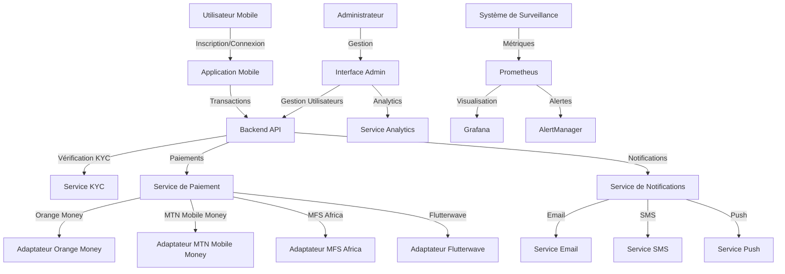

# 🌍 CROSSPAY AFRICA


<div align="center">
  
  
  **La plateforme de paiement transfrontalière révolutionnaire pour l'Afrique**
  
  *Connecter l'Afrique à travers des paiements sans frontières avec une expérience utilisateur futuriste*
</div>

---

## 🚀 Vision

**CrossPay Africa** transforme les paiements transfrontaliers en Afrique en offrant une solution unifiée, sécurisée et accessible. Notre plateforme élimine les barrières financières entre les pays africains, permettant aux utilisateurs d'envoyer et de recevoir de l'argent instantanément, quel que soit leur emplacement ou leur devise.

---

## 🔍 Aperçu du Système



---

## 💡 Fonctionnalités Principales

### 📱 Application Mobile
- **Transferts d'argent instantanés** entre pays africains
- **Multi-devises** avec conversion automatique aux meilleurs taux
- **Vérification KYC** sécurisée et simplifiée
- **Notifications en temps réel** (push, SMS, email)
- **Historique des transactions** détaillé et transparent
- **Interface intuitive** avec navigation par onglets
- **Gestion de profil** complète
- **Détails de transactions** avec tracking en temps réel

### 🖥️ Interface Administrateur (Next.js)
- **Tableau de bord analytique** avec visualisations avancées et design futuriste
- **Interface utilisateur moderne** avec Chakra UI et Framer Motion
- **Gestion des utilisateurs** et vérification KYC simplifiée
- **Suivi des transactions** en temps réel avec notifications
- **Rapports financiers** détaillés et exportables
- **Performance du système** en temps réel avec métriques clés
- **Design responsive** adapté à tous les appareils
- **Mode sombre/clair** avec ThemeToggle
- **Animations fluides** avec PageTransition
- **Tests unitaires** avec Jest et Testing Library

### 🔒 Sécurité et Conformité
- **Authentification JWT** avec stratégies Passport
- **Guards de sécurité** (JWT, Local, Roles)
- **Validation des données** avec class-validator
- **Chiffrement de bout en bout**
- **Helmet.js** pour la sécurité des en-têtes HTTP
- **Throttling** pour prévenir les abus
- **Conformité réglementaire** avec les normes africaines
- **Système anti-fraude** avancé

### 🎯 Intégrations de Paiement
- **Orange Money** - Adaptateur avec simulation pour tests
- **MTN Mobile Money** - Adaptateur avec simulation pour tests
- **MFS Africa** - Support pour 7+ pays africains (KE, GH, SN, CI, UG, TZ, RW)
- **Flutterwave** - Support pour 6+ pays africains (NG, GH, KE, UG, ZA, TZ)
- **Architecture modulaire** permettant l'ajout facile de nouveaux fournisseurs

---

## 🔄 Flux Utilisateur

1. **Inscription et KYC**
   - L'utilisateur télécharge l'application
   - Création de compte avec email/téléphone
   - Vérification d'identité via le processus KYC
   - Approbation par l'équipe administrative

2. **Transfert d'Argent**
   - Sélection du destinataire et du montant
   - Choix de la méthode de paiement (Orange Money/MTN/MFS/Flutterwave)
   - Confirmation et authentification
   - Traitement instantané de la transaction
   - Notification au destinataire

3. **Réception de Fonds**
   - Notification de réception
   - Fonds disponibles immédiatement
   - Option de retrait ou de conservation dans le portefeuille

---

## 🛠️ Architecture Technique

### 🏗️ Architecture Monorepo
Le projet utilise une architecture monorepo avec npm workspaces pour faciliter le partage de code et la gestion des dépendances.

### 🧩 Structure du Projet
```
crosspay-africa/
├── apps/                              # Applications frontales
│   ├── admin/                         # Interface administrateur (Next.js)
│   │   ├── components/                # Composants React réutilisables
│   │   │   ├── AnimatedButton.tsx    # Boutons avec animations
│   │   │   ├── Layout.tsx            # Layout principal
│   │   │   ├── PageTransition.tsx    # Transitions de pages
│   │   │   └── ThemeToggle.tsx       # Toggle dark/light mode
│   │   ├── contexts/                  # Contextes React
│   │   │   ├── AuthContext.tsx       # Gestion de l'authentification
│   │   │   └── ThemeContext.tsx      # Gestion du thème
│   │   ├── pages/                     # Pages Next.js
│   │   │   ├── _app.tsx              # Configuration de l'application
│   │   │   ├── index.tsx             # Tableau de bord
│   │   │   ├── kyc/                  # Gestion KYC
│   │   │   ├── login.tsx             # Page de connexion
│   │   │   ├── settings.tsx          # Paramètres
│   │   │   └── transactions.tsx      # Gestion des transactions
│   │   ├── __tests__/                # Tests unitaires
│   │   ├── package.json
│   │   └── tsconfig.json
│   │
│   └── mobile/                        # Application mobile (React Native + Expo)
│       ├── src/
│       │   └── screens/              # Écrans de l'application
│       │       ├── SendMoneyScreen.tsx
│       │       ├── ProfileScreen.tsx
│       │       ├── EditProfileScreen.tsx
│       │       ├── TransactionHistoryScreen.tsx
│       │       └── TransactionDetailsScreen.tsx
│       ├── screens/
│       │   └── KycVerificationScreen.tsx
│       ├── __tests__/                # Tests unitaires
│       ├── App.tsx                   # Point d'entrée
│       ├── package.json
│       └── webpack.config.js
│
├── services/                          # Microservices backend
│   ├── backend/                       # API principale (NestJS)
│   │   ├── src/
│   │   │   ├── auth/                 # Module d'authentification
│   │   │   │   ├── guards/           # Guards JWT, Local, Roles
│   │   │   │   ├── strategies/       # Stratégies Passport
│   │   │   │   ├── dto/              # Data Transfer Objects
│   │   │   │   └── decorators/       # Décorateurs personnalisés
│   │   │   ├── users/                # Module utilisateurs
│   │   │   │   ├── entities/         # Entity User (TypeORM)
│   │   │   │   └── dto/              # DTOs pour les utilisateurs
│   │   │   ├── kyc/                  # Module KYC
│   │   │   │   ├── entities/         # Entity KycVerification
│   │   │   │   └── dto/              # DTOs pour KYC
│   │   │   ├── payments/             # Module de paiement
│   │   │   │   ├── adapters/         # Adaptateurs de paiement
│   │   │   │   │   ├── orange-money.adapter.ts
│   │   │   │   │   ├── mtn-mobile-money.adapter.ts
│   │   │   │   │   └── payment-adapter.interface.ts
│   │   │   │   ├── services/         # Services de paiement
│   │   │   │   └── quote.service.ts  # Service de devis
│   │   │   ├── notifications/        # Module de notifications
│   │   │   │   └── entities/         # Entity Notification
│   │   │   ├── analytics/            # Module d'analytiques
│   │   │   ├── monitoring/           # Module de surveillance
│   │   │   │   ├── metrics.interceptor.ts
│   │   │   │   ├── metrics.service.ts
│   │   │   │   └── prometheus.config.ts
│   │   │   ├── transactions/         # Module de transactions
│   │   │   ├── recipients/           # Module de destinataires
│   │   │   ├── webhooks/             # Module de webhooks
│   │   │   ├── app.module.ts         # Module principal
│   │   │   └── main.ts               # Point d'entrée
│   │   ├── Dockerfile
│   │   ├── package.json
│   │   └── tsconfig.json
│   │
│   └── payments/                      # Service de paiement séparé
│       ├── src/
│       │   └── adapters/             # Adaptateurs additionnels
│       │       ├── flutterwave-adapter.ts
│       │       ├── mfs-adapter.ts
│       │       └── payment-adapter.interface.ts
│       ├── Dockerfile
│       └── package.json
│
├── docker/                            # Configuration Docker
│   ├── prometheus/                    # Configuration Prometheus
│   │   ├── prometheus.yml
│   │   └── alert.rules.yml
│   ├── grafana/                       # Tableaux de bord Grafana
│   │   └── provisioning/
│   │       └── dashboards/
│   └── alertmanager/                  # Configuration des alertes
│       └── alertmanager.yml
│
├── docs/                              # Documentation
│   └── integration-checklist.md      # Guide d'intégration des paiements
│
├── docker-compose.yml                 # Services principaux
├── docker-compose.monitoring.yml      # Stack de surveillance
├── build-partial.js                   # Script de compilation partielle
├── package.json                       # Configuration du monorepo
└── README.md
```

### 🔧 Stack Technologique

#### Backend
- **Framework**: NestJS 9.0
- **Langage**: TypeScript 4.8
- **Base de données**: PostgreSQL 14
- **ORM**: TypeORM 0.3.9
- **Cache**: Redis
- **Authentification**: Passport.js (JWT, Local)
- **Validation**: class-validator, class-transformer
- **Sécurité**: Helmet, bcrypt
- **Documentation API**: Swagger/OpenAPI
- **Monitoring**: Prometheus, prom-client
- **Email**: Nodemailer

#### Frontend Admin
- **Framework**: Next.js 13.4
- **Langage**: TypeScript 5.1
- **UI**: Chakra UI 2.8, Emotion
- **Animations**: Framer Motion 10.18
- **Icônes**: React Icons 4.10
- **Formulaires**: React Hook Form 7.45
- **Data Fetching**: SWR 2.2, Axios 1.4
- **Tests**: Jest 29, Testing Library

#### Mobile
- **Framework**: React Native 0.69 + Expo 46
- **Langage**: TypeScript 4.3
- **Navigation**: React Navigation 6
- **Authentification**: Expo Local Authentication
- **HTTP**: Axios 1.1
- **Tests**: Jest 29, Testing Library React Native

#### Surveillance et DevOps
- **Monitoring**: Prometheus, Grafana, AlertManager
- **Conteneurisation**: Docker, Docker Compose
- **CI/CD**: Scripts de build automatisés
- **Métriques**: @willsoto/nestjs-prometheus

---

## 🚀 Guide de Déploiement

### Prérequis
- **Docker** et **Docker Compose** (v3.8+)
- **Node.js** v14+ (recommandé: v18+)
- **npm** v6+
- **PostgreSQL** 14
- **Redis** (alpine)
- Accès aux API des fournisseurs de paiement

### Installation

#### 1. Cloner le dépôt
```bash
git clone https://github.com/cabrelngamaleu/TransAfrikMob.git
cd TransAfrikMob/crosspay-africa
```

#### 2. Installation des dépendances
```bash
# Installation des dépendances du monorepo
npm install

# Installation des dépendances de l'admin
cd apps/admin && npm install && cd ../..

# Installation des dépendances du mobile
cd apps/mobile && npm install && cd ../..

# Installation des dépendances du backend
cd services/backend && npm install && cd ../..
```

#### 3. Configuration des variables d'environnement

Créez un fichier `.env` dans le dossier `crosspay-africa` et configurez les variables suivantes:

```env
# Base de données
DB_TYPE=postgres
DB_HOST=localhost
DB_PORT=5432
DB_USERNAME=postgres
DB_PASSWORD=postgres
DB_DATABASE=crosspay
DB_SYNCHRONIZE=true

# Redis
REDIS_HOST=localhost
REDIS_PORT=6379

# JWT
JWT_SECRET=your-super-secret-jwt-key
JWT_EXPIRES_IN=7d

# Services de paiement
PAYMENTS_SERVICE_URL=http://localhost:3001

# Orange Money
ORANGE_MONEY_API_URL=https://api.orange.com/orange-money-webpay/
ORANGE_MONEY_API_KEY=your-orange-money-api-key
ORANGE_MONEY_MERCHANT_ID=your-merchant-id

# MTN Mobile Money
MTN_API_URL=https://sandbox.momodeveloper.mtn.com
MTN_API_KEY=your-mtn-api-key
MTN_API_SECRET=your-mtn-api-secret

# MFS Africa
MFS_API_KEY=your-mfs-api-key
MFS_API_SECRET=your-mfs-api-secret
MFS_API_URL=https://api.mfsafrica.com

# Flutterwave
FLUTTERWAVE_PUBLIC_KEY=your-flutterwave-public-key
FLUTTERWAVE_SECRET_KEY=your-flutterwave-secret-key
FLUTTERWAVE_ENCRYPTION_KEY=your-flutterwave-encryption-key
FLUTTERWAVE_API_URL=https://api.flutterwave.com/v3

# Application
NODE_ENV=development
PORT=3000
```

#### 4. Démarrer les services avec Docker

**Services principaux (PostgreSQL, Redis, Backend, Payments):**
```bash
docker-compose up -d
```

**Stack de surveillance (Prometheus, Grafana, AlertManager):**
```bash
docker-compose -f docker-compose.monitoring.yml up -d
```

#### 5. Démarrer l'interface admin
```bash
cd apps/admin
npm run dev          # Mode développement (port 3000)
# OU
npm run build        # Build de production
npm start            # Démarrer en production
```

#### 6. Démarrer l'application mobile
```bash
cd apps/mobile
npm start            # Démarrer Expo DevTools

# Options:
npm run android      # Lancer sur Android
npm run ios          # Lancer sur iOS
npm run web          # Lancer sur le web
```

#### 7. Compilation partielle (optionnel)
Pour compiler uniquement certaines parties du projet:
```bash
node build-partial.js
```
Ce script compile l'admin, exporte le mobile pour le web, et compile le backend avec `--skipLibCheck`.

### Accès aux interfaces

| Service | URL | Identifiants |
|---------|-----|--------------|
| **API Backend** | http://localhost:3000 | - |
| **API Documentation (Swagger)** | http://localhost:3000/api | - |
| **Interface Admin** | http://localhost:3000 (dev) | Voir AuthContext |
| **Application Mobile** | Expo DevTools | - |
| **Service de Paiements** | http://localhost:3001 | - |
| **PostgreSQL** | localhost:5432 | postgres/postgres |
| **Redis** | localhost:6379 | - |
| **Prometheus** | http://localhost:9090 | - |
| **Grafana** | http://localhost:3001 | admin/admin |
| **AlertManager** | http://localhost:9093 | - |

---

## 📊 Surveillance et Maintenance

### Métriques Clés
- **Taux de réussite des transactions** - Pourcentage de transactions complétées avec succès
- **Temps de réponse de l'API** - Latence moyenne des requêtes API
- **Nombre d'utilisateurs actifs** - Utilisateurs actifs quotidiennement/mensuellement
- **Volume de transactions par devise** - Distribution des transactions par devise
- **Statut des vérifications KYC** - Nombre de vérifications en attente/approuvées/rejetées
- **Performance des adaptateurs** - Taux de réussite par fournisseur de paiement

### Alertes Configurées
- ⚠️ **Latence élevée des requêtes API** (> 500ms)
- 🔴 **Taux d'erreur élevé** (> 5%)
- 🚨 **Service indisponible** (downtime)
- 📈 **Pic anormal de transactions** (> 2x la moyenne)
- 💾 **Utilisation élevée de la base de données**
- 🔒 **Tentatives de connexion suspectes**

### Tests

**Backend:**
```bash
cd services/backend
npm test              # Tests unitaires
npm run test:cov      # Avec couverture de code
npm run test:e2e      # Tests end-to-end
```

**Frontend Admin:**
```bash
cd apps/admin
npm test              # Tests unitaires
npm run test:watch    # Mode watch
```

**Mobile:**
```bash
cd apps/mobile
npm test              # Tests unitaires (avec Jest Expo)
```

---

## 🎨 Fonctionnalités UI/UX

### Interface Admin
- 🌓 **Mode sombre/clair** avec transition fluide
- 🎭 **Animations de page** avec Framer Motion
- 📊 **Graphiques interactifs** avec des statistiques en temps réel
- 🎨 **Design système moderne** basé sur Chakra UI
- 📱 **Responsive design** pour mobile, tablette et desktop
- ⚡ **Performance optimisée** avec Next.js
- 🔔 **Notifications en temps réel**

### Application Mobile
- 📱 **Navigation intuitive** avec React Navigation
- 🔒 **Authentification biométrique** (empreinte digitale/Face ID)
- 💰 **Envoi d'argent simplifié** en quelques taps
- 📜 **Historique des transactions** avec filtres
- 👤 **Gestion de profil** complète
- 🌐 **Support multi-langues** (prêt)

---

## 🔄 Intégration des Fournisseurs de Paiement

Le projet dispose d'une architecture modulaire permettant l'intégration facile de nouveaux fournisseurs de paiement. Consultez la [documentation d'intégration](./crosspay-africa/docs/integration-checklist.md) pour plus de détails sur:

- ✅ **MFS Africa** - Procédures administratives et techniques
- ✅ **Flutterwave** - Configuration et intégration
- ✅ **Orange Money** - Adaptateur implémenté
- ✅ **MTN Mobile Money** - Adaptateur implémenté
- 📋 **Beyonic** - Guide d'intégration disponible

Chaque adaptateur implémente l'interface `IPaymentAdapter` avec:
- `sendPayment()` - Initier un paiement
- `checkStatus()` - Vérifier le statut d'une transaction
- `supportsCountry()` - Vérifier le support d'un pays
- `isConfigured()` - Vérifier la configuration

---

## 🔮 Feuille de Route

### ✅ Complété
- [x] Architecture backend NestJS avec TypeORM
- [x] Interface admin moderne avec Next.js et Chakra UI
- [x] Application mobile React Native avec Expo
- [x] Système d'authentification JWT
- [x] Module KYC avec workflow d'approbation
- [x] Adaptateurs Orange Money et MTN Mobile Money
- [x] Adaptateurs MFS Africa et Flutterwave
- [x] Système de surveillance avec Prometheus et Grafana
- [x] Tests unitaires pour les principaux composants
- [x] Système de notifications
- [x] Module d'analytics

### 🚧 En Cours
- [ ] **Tests end-to-end complets** pour tous les modules
- [ ] **Intégration réelle des API** de paiement (actuellement en mode simulation)
- [ ] **Webhook handlers** pour les notifications de paiement
- [ ] **Système de réconciliation** des transactions

### 📋 À Venir
- [ ] **Intégration de nouvelles passerelles de paiement** (Paystack, Stripe)
- [ ] **Support multi-langues** (Français, Anglais, Swahili)
- [ ] **Application mobile hors ligne** avec synchronisation
- [ ] **Système de fidélité et récompenses**
- [ ] **Expansion vers de nouveaux marchés africains**
- [ ] **API publique pour développeurs tiers**
- [ ] **Tableau de bord analytics avancé** avec prédictions ML
- [ ] **Support des crypto-monnaies**

---

## 🧪 Développement

### Scripts Disponibles

**Monorepo (racine):**
```bash
npm run start:dev    # Démarrer tous les services en mode dev
npm run build        # Compiler tous les projets (sauf mobile)
npm test             # Exécuter tous les tests
npm run docker:up    # Démarrer les services Docker
npm run docker:down  # Arrêter les services Docker
```

**Backend:**
```bash
npm run start:dev    # Mode développement avec hot-reload
npm run build        # Compiler le backend
npm run start:prod   # Démarrer en production
npm run lint         # Linter le code
```

**Admin:**
```bash
npm run dev          # Mode développement
npm run build        # Build de production
npm start            # Serveur de production
npm run lint         # Linter le code
```

**Mobile:**
```bash
npm start            # Démarrer Expo DevTools
npm run android      # Ouvrir sur Android
npm run ios          # Ouvrir sur iOS
npm run web          # Ouvrir dans le navigateur
```

### Structure des Modules Backend

Chaque module suit une architecture similaire:
```
module/
├── dto/                    # Data Transfer Objects
├── entities/               # Entités TypeORM
├── guards/                 # Guards de sécurité (si applicable)
├── services/               # Services métier
├── controllers/            # Contrôleurs API
├── module-name.module.ts   # Module NestJS
└── *.spec.ts              # Tests unitaires
```

---

## 📚 Documentation API

L'API REST est documentée avec **Swagger/OpenAPI** et accessible à l'adresse:
```
http://localhost:3000/api
```

### Principaux endpoints:

#### Authentification
- `POST /auth/register` - Inscription d'un nouvel utilisateur
- `POST /auth/login` - Connexion
- `POST /auth/refresh` - Rafraîchir le token JWT

#### Utilisateurs
- `GET /users` - Liste des utilisateurs (Admin)
- `GET /users/:id` - Détails d'un utilisateur
- `PATCH /users/:id` - Mettre à jour un utilisateur

#### KYC
- `POST /kyc` - Soumettre une vérification KYC
- `GET /kyc` - Liste des vérifications KYC
- `PATCH /kyc/:id/approve` - Approuver une vérification (Admin)
- `PATCH /kyc/:id/reject` - Rejeter une vérification (Admin)

#### Paiements
- `POST /payments/initiate` - Initier un paiement
- `GET /payments/:id` - Détails d'un paiement
- `POST /payments/verify` - Vérifier le statut d'un paiement
- `GET /payments/quote` - Obtenir un devis de conversion

#### Analytics
- `GET /analytics/dashboard` - Statistiques du tableau de bord
- `GET /analytics/transactions` - Analytiques des transactions

#### Webhooks
- `POST /webhooks/orange-money` - Webhook Orange Money
- `POST /webhooks/mtn` - Webhook MTN Mobile Money
- `POST /webhooks/mfs` - Webhook MFS Africa
- `POST /webhooks/flutterwave` - Webhook Flutterwave

---

## 🔐 Sécurité

### Meilleures Pratiques Implémentées
- ✅ **Authentification JWT** avec rotation des tokens
- ✅ **Validation des entrées** avec class-validator
- ✅ **Protection CSRF** avec Helmet
- ✅ **Rate limiting** avec @nestjs/throttler
- ✅ **Hashing des mots de passe** avec bcrypt
- ✅ **CORS configuré** de manière restrictive
- ✅ **Variables d'environnement** pour les secrets
- ✅ **Guards par rôle** (User, Admin)
- ✅ **HTTPS recommandé** en production

### Recommandations pour la Production
1. 🔒 Utiliser HTTPS/TLS pour toutes les communications
2. 🔑 Générer des secrets JWT forts et uniques
3. 🛡️ Configurer un WAF (Web Application Firewall)
4. 📝 Activer les logs d'audit
5. 🔄 Mettre en place une rotation régulière des secrets
6. 🚫 Désactiver `DB_SYNCHRONIZE` en production
7. 🔐 Utiliser des secrets managers (AWS Secrets Manager, Vault)

---

## 🤝 Contribution

Les contributions sont les bienvenues! Pour contribuer:

1. 🍴 Forkez le projet
2. 🌱 Créez une branche feature (`git checkout -b feature/AmazingFeature`)
3. 💾 Committez vos changements (`git commit -m 'Add some AmazingFeature'`)
4. 📤 Poussez vers la branche (`git push origin feature/AmazingFeature`)
5. 🔀 Ouvrez une Pull Request

### Conventions de Code
- **TypeScript** strict mode activé
- **ESLint** + **Prettier** pour le formatage
- **Tests** obligatoires pour les nouvelles fonctionnalités
- **Documentation** des fonctions publiques
- **Commits conventionnels** (feat, fix, docs, etc.)

---

## 📞 Support et Contact

Pour toute question, assistance ou partenariat:

- 📧 **Email**: support@crosspay.africa
- 🌐 **Site web**: https://crosspay.africa
- 📱 **Téléphone**: +237 695 669 921
- 💼 **LinkedIn**: [Cabrel Ngamaleu](https://linkedin.com/in/cabrel-ngamaleu)
- 🐙 **GitHub**: [github.com/cabrel-ngamaleu](https://github.com/cabrel-ngamaleu)

### Signaler un Bug
Ouvrez une issue sur GitHub avec:
- Description détaillée du problème
- Étapes pour reproduire
- Comportement attendu vs actuel
- Logs/captures d'écran si applicable

---

## 📄 License

Ce projet est sous licence **MIT**. Voir le fichier [LICENSE](LICENSE) pour plus de détails.

---

## 🙏 Remerciements

Merci à tous les contributeurs et à la communauté open-source pour:
- **NestJS** - Framework backend élégant
- **Next.js** - Framework React pour la production
- **Chakra UI** - Système de design accessible
- **React Native** - Framework mobile cross-platform
- **Expo** - Plateforme de développement mobile
- **TypeORM** - ORM TypeScript avancé
- **Prometheus** & **Grafana** - Surveillance et monitoring

---

<div align="center">
  <p>© 2025 CrossPay Africa. Tous droits réservés.</p>
  <p><strong>Créé avec ❤️ par Cabrel Ngamaleu</strong></p>
  <p><em>Construire l'avenir des paiements en Afrique 🌍</em></p>
  
  <br/>
  
  
  
  
</div>
