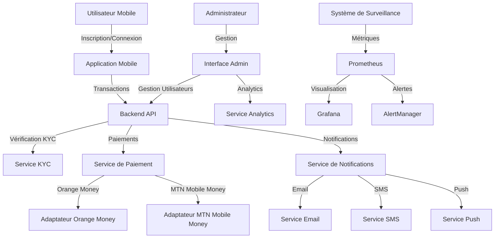

# 🌍 CROSSPAY AFRICA


<div align="center">
  
  
  **La plateforme de paiement transfrontalière révolutionnaire pour l'Afrique**
  
  *Connecter l'Afrique à travers des paiements sans frontières avec une expérience utilisateur futuriste*
</div>

---

## 🚀 Vision

**CrossPay Africa** transforme les paiements transfrontaliers en Afrique en offrant une solution unifiée, sécurisée et accessible. Notre plateforme élimine les barrières financières entre les pays africains, permettant aux utilisateurs d'envoyer et de recevoir de l'argent instantanément, quel que soit leur emplacement ou leur devise.

---

## 🔍 Aperçu du Système



---

## 💡 Fonctionnalités Principales

### 📱 Application Mobile
- **Transferts d'argent instantanés** entre pays africains
- **Multi-devises** avec conversion automatique aux meilleurs taux
- **Vérification KYC** sécurisée et simplifiée
- **Notifications en temps réel** (push, SMS, email)
- **Historique des transactions** détaillé et transparent
- **Paiement via Orange Money et MTN Mobile Money**

### 🖥️ Interface Administrateur
- **Tableau de bord analytique** avec visualisations avancées et design futuriste
- **Interface utilisateur moderne** avec expérience utilisateur optimisée
- **Gestion des utilisateurs** et vérification KYC simplifiée
- **Suivi des transactions** en temps réel avec notifications
- **Rapports financiers** détaillés et exportables
- **Performance du système** en temps réel avec métriques clés
- **Design responsive** adapté à tous les appareils

### 🔒 Sécurité et Conformité
- **Authentification à deux facteurs**
- **Chiffrement de bout en bout**
- **Conformité réglementaire** avec les normes africaines
- **Système anti-fraude** avancé

---

## 🔄 Flux Utilisateur

1. **Inscription et KYC**
   - L'utilisateur télécharge l'application
   - Création de compte avec email/téléphone
   - Vérification d'identité via le processus KYC
   - Approbation par l'équipe administrative

2. **Transfert d'Argent**
   - Sélection du destinataire et du montant
   - Choix de la méthode de paiement (Orange Money/MTN Mobile Money)
   - Confirmation et authentification
   - Traitement instantané de la transaction
   - Notification au destinataire

3. **Réception de Fonds**
   - Notification de réception
   - Fonds disponibles immédiatement
   - Option de retrait ou de conservation dans le portefeuille

---

## 🛠️ Architecture Technique

### 🧩 Structure du Projet
```
crosspay-africa/
├── apps/                  # Applications frontales
│   ├── admin/             # Interface administrateur
│   └── mobile/            # Application mobile React Native
├── services/              # Microservices backend
│   ├── backend/           # API principale NestJS
│   ├── payments/          # Service de paiement
│   └── mobile/            # Services spécifiques mobile
├── libs/                  # Bibliothèques partagées
├── docker/                # Configuration Docker
│   ├── prometheus/        # Configuration Prometheus
│   ├── grafana/           # Tableaux de bord Grafana
│   └── alertmanager/      # Configuration des alertes
└── docs/                  # Documentation
```

### 🔧 Stack Technologique
- **Backend**: NestJS, TypeScript, PostgreSQL
- **Frontend Admin**: React, TypeScript, Chart.js
- **Mobile**: React Native, TypeScript
- **Paiement**: Adaptateurs Orange Money et MTN Mobile Money
- **Surveillance**: Prometheus, Grafana, AlertManager
- **Déploiement**: Docker, Docker Compose

---

## 🚀 Guide de Déploiement

### Prérequis
- Docker et Docker Compose
- Node.js (v14+)
- PostgreSQL
- Accès aux API Orange Money et MTN Mobile Money

### Installation

1. **Cloner le dépôt**
   ```bash
   git clone https://github.com/cabrel-ngamaleu/crosspay-africa.git
   cd crosspay-africa
   ```

2. **Configuration des variables d'environnement**
   ```bash
   cp .env.example .env
   # Éditer le fichier .env avec vos configurations
   ```

3. **Démarrer les services backend**
   ```bash
   docker-compose up -d
   ```

4. **Démarrer le système de surveillance**
   ```bash
   docker-compose -f docker-compose.monitoring.yml up -d
   ```

5. **Installer et démarrer l'interface admin**
   ```bash
   cd apps/admin
   npm install
   npm run build
   npm start
   ```

6. **Installer et démarrer l'application mobile (développement)**
   ```bash
   cd apps/mobile
   npm install
   npm run start
   ```

### Accès aux interfaces

- **API Backend**: http://localhost:3000
- **Interface Admin**: http://localhost:4000
- **Prometheus**: http://localhost:9090
- **Grafana**: http://localhost:3001 (admin/admin)
- **AlertManager**: http://localhost:9093

---

## 📊 Surveillance et Maintenance

### Métriques Clés
- Taux de réussite des transactions
- Temps de réponse de l'API
- Nombre d'utilisateurs actifs
- Volume de transactions par devise
- Statut des vérifications KYC

### Alertes Configurées
- Latence élevée des requêtes API
- Taux d'erreur élevé
- Service indisponible
- Pic anormal de transactions

---

## 🔮 Feuille de Route

- [ ] **Intégration de nouvelles passerelles de paiement**
- [ ] **Support multi-langues**
- [ ] **Application mobile hors ligne**
- [ ] **Système de fidélité et récompenses**
- [ ] **Expansion vers de nouveaux marchés africains**

---

## 📞 Support et Contact

Pour toute question ou assistance, contactez-nous à:
- 📧 Email: support@crosspay.africa
- 🌐 Site web: https://crosspay.africa
- 📱 Téléphone: +237 695 669 921

---

<div align="center">
  <p>© 2025 CrossPay Africa. Tous droits réservés. Créé par Cabrel Ngamaleu</p>
  <p>Construire l'avenir des paiements en Afrique 🌍</p>
</div>